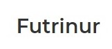

<!-- PROJECT LOGO -->
 

  

  <h3 align="center">Futrinur</h3>

  

    A Furniture Site For Furniture 😮 
     
    (Yup, you read right, it's for DAMN furniture)
     
     
    <a href="https://milind-jamnekar.github.io/Futrinur/">View Demo</a>
    ·
    <a href="#">Report Bug</a>
    ·
    <a href="https://github.com/othneildrew/Best-README-Template/issues">Request Feature</a>
  

<!-- TABLE OF CONTENTS -->

<!-- ABOUT THE PROJECT -->

## About The Project

This Website nothing but i'm practicing building website as I am currently learning html and css. Do not take this website as a real business. All this website is built for education purpose only

### Built With

- HTML
- CSS
- Javascript

<!-- GETTING STARTED -->

<!-- CONTACT -->

## Contact

Twitter - [@MilindJamnekar](https://twitter.com/MilindJamnekar) - email@example.com

Project Link: [https://github.com/Milind-Jamnekar/Futrinur](https://github.com/Milind-Jamnekar/Futrinur)

<!-- ACKNOWLEDGEMENTS -->

## Acknowledgements

- [Design From Dribble ](https://dribbble.com/shots/14757207-Furnitur-Furniture-Landing-Page), Designer [Malik Abimanyu](https://dribbble.com/abimanyu17)

<!-- MARKDOWN LINKS & IMAGES -->
<!-- https://www.markdownguide.org/basic-syntax/#reference-style-links -->

[contributors-shield]: https://img.shields.io/github/contributors/othneildrew/Best-README-Template.svg?style=for-the-badge
[contributors-url]: https://github.com/othneildrew/Best-README-Template/graphs/contributors
[forks-shield]: https://img.shields.io/github/forks/othneildrew/Best-README-Template.svg?style=for-the-badge
[forks-url]: https://github.com/othneildrew/Best-README-Template/network/members
[stars-shield]: https://img.shields.io/github/stars/othneildrew/Best-README-Template.svg?style=for-the-badge
[stars-url]: https://github.com/othneildrew/Best-README-Template/stargazers
[issues-shield]: https://img.shields.io/github/issues/othneildrew/Best-README-Template.svg?style=for-the-badge
[issues-url]: https://github.com/othneildrew/Best-README-Template/issues
[license-shield]: https://img.shields.io/github/license/othneildrew/Best-README-Template.svg?style=for-the-badge
[license-url]: https://github.com/othneildrew/Best-README-Template/blob/master/LICENSE.txt
[linkedin-shield]: https://img.shields.io/badge/-LinkedIn-black.svg?style=for-the-badge&logo=linkedin&colorB=555
[linkedin-url]: https://linkedin.com/in/othneildrew
[product-screenshot]: images/screenshot.png
